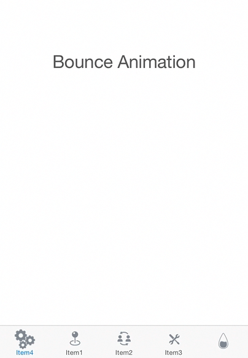
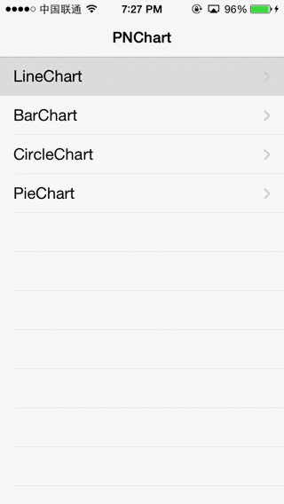
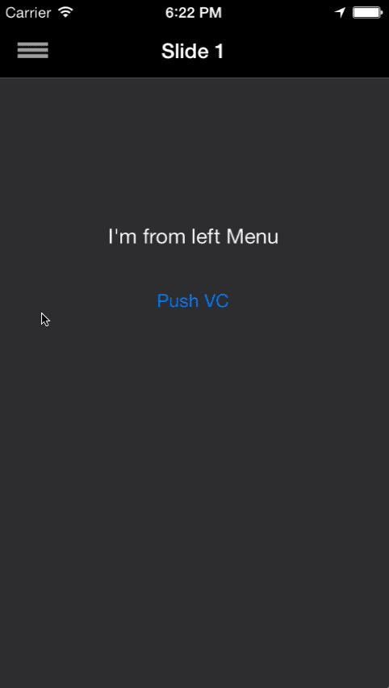
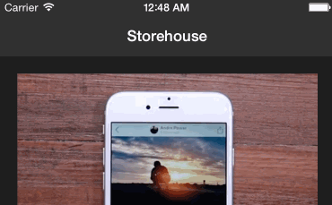
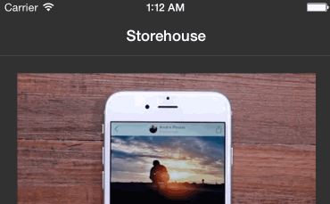
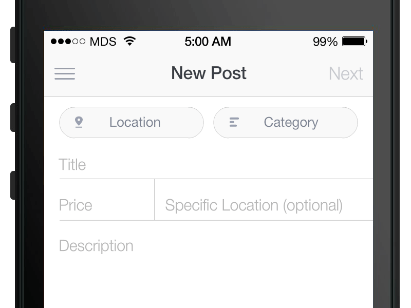
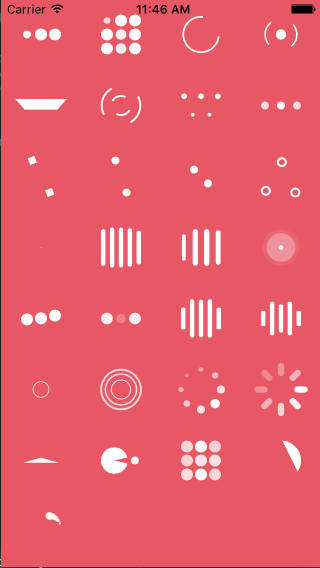

| name         | description                              |
| ------------ | ---------------------------------------- |
| Alamofire    | 著名的AFNetworking网络基础库Swift版 <br/> [Alamofire/Alamofire](https://github.com/Alamofire/Alamofire) |
| SQLite.swift | 简单、轻量，使用上最SQL的SQLite封装库 <br/>  [stephencelis/SQLite.swift](https://github.com/stephencelis/SQLite.swift) |
| Cartography  | 用代码解决麻烦的AutoLayout <br/> [robb/Cartography](https://github.com/robb/Cartography) |

### [Cartography](https://github.com/robb/Cartography)

##### In short, it allows you to replace this:
```Swift
addConstraint(NSLayoutConstraint(
    item: button1,
    attribute: .Right,
    relatedBy: .Equal,
    toItem: button2,
    attribute: .Left,
    multiplier: 1.0,
    constant: -12.0
))
```
##### with this
```Swift
constrain(button1, button2) { button1, button2 in
    button1.right == button2.left - 12
}
```


### awesome-ios-ui
Repo | sample demo & description
--- | ---
[animated-tab-bar](https://github.com/Ramotion/animated-tab-bar) <br/> github: https://github.com/Ramotion/animated-tab-bar |  
[PNChart-Swift](https://github.com/kevinzhow/PNChart-Swift) | 带动画效果的图表控件库 
[LTMorphingLabel](https://github.com/lexrus/LTMorphingLabel) | 各种文字动画效果 <br/> .fall:  <br/> .scale: 
[AMSlideMenu](https://github.com/SocialObjects-Software/AMSlideMenu) | 
[CBStoreHouseRefreshControl](https://github.com/coolbeet/CBStoreHouseRefreshControl) |  
[FoldingTabBar](https://github.com/Yalantis/FoldingTabBar.iOS) | 
[JazzHands](https://github.com/IFTTT/JazzHands) | 
[JVFloatLabeledTextField](https://github.com/jverdi/JVFloatLabeledTextField) | 
[NVActivityIndicatorView](https://github.com/ninjaprox/NVActivityIndicatorView) | 
[RESideMenu](https://github.com/romaonthego/RESideMenu) | 
